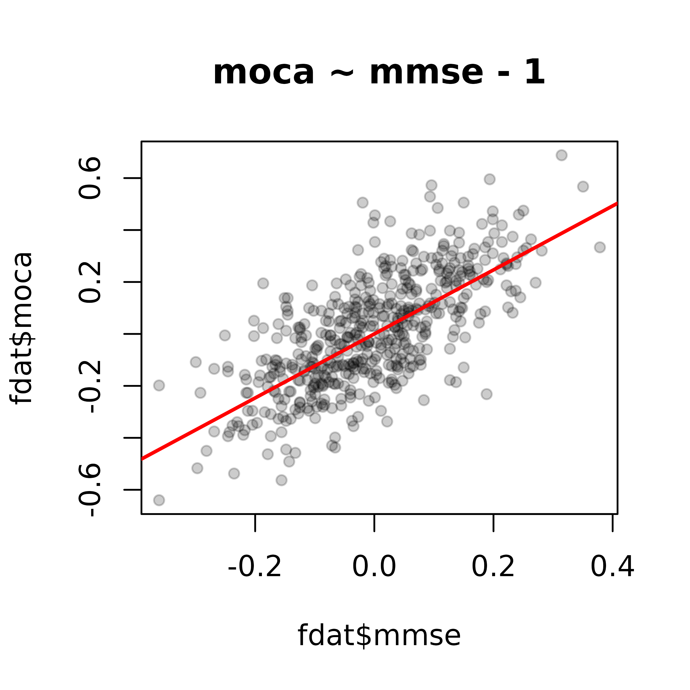

# Getting Started with cogxwalkr

## Introduction

`cogxwalkr` is an R package designed to facilitate crosswalking—or
translating effect estimates—between different cognitive outcome
measures in studies of cognitive aging, exposures, and interventions. It
enables researchers to compare results across studies that use different
cognitive tests.

This package implements methods described in (Ackley et al. 2025). The
manuscript authors developed two methods to crosswalk estimated
treatment effects of cognitive outcomes that are flexible, broadly
applicable, work when only summary statistics are available, and do not
rely on strong distributional assumptions. This method requires access
to a dataset that includes both the cognitive measure you wish to
crosswalk from and the cognitive measure you wish to crosswalk to.

The package was developed by Sarah Ackley and Jason Gantenberg. This
vignette demonstrates how to use cogxwalkr in R.

## Installing

To install the package, you will first need to install and load the
remotes package, which you can do from the R console:

To install the package:

``` r
install.packages("remotes")
remotes::install_github("jrgant/cogxwalkr")
```

### Installation Errors

You may get an error message that reads:

    Using GitHub PAT from the git credential store.
    Error: Failed to install 'remotes' from GitHub:
      HTTP error 401.
      Bad credentials

The most likely cause is that `remotes` detects a bad Github token in
your credential store. Run
[`gitcreds::gitcreds_delete()`](https://gitcreds.r-lib.org/reference/gitcreds_get.html),
select option `2` to remove the bad credential from the store, and rerun
the `remotes::install_github()` command above.

Alternatively, you may get a similar error message that reads:

    Using github PAT from envvar GITHUB_PAT. Use `gitcreds::gitcreds_set()` and unset GITHUB_PAT in .Renviron (or elsewhere) if you want to use the more secure git credential store instead.
    Error: Failed to install 'cogxwalkr' from GitHub:
      HTTP error 401.
      Bad credentials

In this case, run `Sys.setenv(GITHUB_PAT = "")` and then rerun the
`remotes::install_github()` command above.

## Motivation

As a motivating example, consider a study estimating the effect of
APOE-ε4 carrier status on scores from the MMSE (Mini-Mental State
Examination). If we wish to compare this effect to results from another
study that used the MoCA (Montreal Cognitive Assessment), we need a
conversion factor that allows us to convert a summary measure on the
MMSE scale to the MoCA scale. `cogxwalkr` aids in estimating the
conversion coefficient required to crosswalk from the MMSE to the MoCA
under the following general assumptions regarding two cognitive measures
(Ackley et al. 2025):

- they measure the same underlying construct (*e.g.*, executive
  function, global cognition, etc.)
- they are correlated only through their measurement of this common
  construct.


Directed acyclic graph reflecting the assumptions required to crosswalk
measure *A* to measure *B*, both of which measure aspects of the
underlying construct *U*.

## Usage

To load the package:

``` r
library(cogxwalkr)
```

### Adjunct Data

These crosswalk methods require individual-level data from an adjunct
study: a study where both cognitive measures are performed for each
participant. In this package, the built-in `cogsim` dataset represents
the adjunct study data. The adjunct data is simulated data based on the
[Alzheimer’s Disease Neuroimaging Initiative](https://adni.loni.usc.edu)
(ADNI). This dataset includes an MMSE score and MoCA score conditional
on binary dementia status (0 for absent and 1 for present) for
approximately 1500 study participants. Code used to fit and simulate
these data can be found at
[](https://jrgant.github.io/cogxwalkr/articles/github/jrgant/data-raw/cogsim.r).

To view the example adjunct study, `cogsim`, we can type either of the
following into the R console:

``` r
head(cogsim)
View(cogsim)
```

Additional information is available via
[`?cogsim`](https://jrgant.github.io/cogxwalkr/reference/cogsim.md).

We implement two methods to obtain crosswalk slopes: 1) unconditional
method and 2) conditional method. The unconditional method requires only
data on both cognitive measures for each individual, whereas the
conditional method requires additional data on a third binary variable,
here dementia status.

### Unconditional Method

To obtain an estimate of the crosswalk slope using the unconditional
method we can use the crosswalk function, which is the workhorse of the
package:

``` r
crosswalk(cog1 = "mmse", cog2 = "moca", data = cogsim, niter = 500)
```

This estimates a crosswalk slope from `cog1`, here the MMSE, to `cog2`,
here the MoCA, using the built-in cogsim data as the adjunct data.
`cog1` and `cog2` must be supplied as strings. `niter` gives the number
of random splits used to obtain the crosswalk. The built-in `cogsim`
dataset can be replaced with any other dataset containing the
appropriate columns. Since this uses the adjunct data without any
bootstrap resampling, no uncertainty on the crosswalked slope is
presented.

``` r
crosswalk(cog1 = "mmse",
          cog2 = "moca",
          data = cogsim,
          niter = 500,
          control = list(nboot = 100, seed = 123))

crosswalk(cog1 = "mmse",
          cog2 = "moca",
          data = cogsim,
          niter = 500,
          control = list(nboot = 100, seed = 123456, ncores = 8))
```

#### Unconditional Method Using Summary Statistics

The unconditional method can also be used based only on summary
statistics. (In many cases, it may be more statistically efficient to do
so, as the number of unconditional split iterations must be chosen with
care.)

The summary statistics approach is accessible directly via the
[`est_cw_coef()`](https://jrgant.github.io/cogxwalkr/reference/crosswalk.md)
function.

``` r
# estimate slope using lm()
est_cw_coef(cog1 = "mmse", cog2 = "moca", data = cogsim, method = "lm")

# estimate slope using manual calculation
est_cw_coef(cog1 == "mmse", cog2 = "moca", data = cogsim, method = "manual")
```

However, we recommend using
[`crosswalk()`](https://jrgant.github.io/cogxwalkr/reference/crosswalk.md)
because other functions in `cogxwalkr` are built to act upon its output,
not that of
[`est_cw_coef()`](https://jrgant.github.io/cogxwalkr/reference/crosswalk.md).

Omitting the `niter` argument when calling
[`crosswalk()`](https://jrgant.github.io/cogxwalkr/reference/crosswalk.md)
will result in the package using the “lm” method to estimate the
crosswalk:

``` r
crosswalk(cog1 = "mmse", cog2 = "moca", data = cogsim)
```

### Conditional Method

To use the conditional method, we must specify an additional binary
variable on which to perform the conditional splits. The optional
`condition_by` input declares this input and, when present, will elicit
the conditional method. Note that
[`crosswalk()`](https://jrgant.github.io/cogxwalkr/reference/crosswalk.md)
will ignore `niter` if `condition_by` is specified.

``` r
crosswalk(cog1 = "mmse",
          cog2 = "moca",
          data = cogsim,
          condition_by = "dementia")
```

### Summary and Plotting Functions

#### Summaries

[`crosswalk()`](https://jrgant.github.io/cogxwalkr/reference/crosswalk.md)
outputs a list containing the results of the estimation
procedure,[¹](#fn1) along with information about the specifications
selected by the user. Similar to
[`glm()`](https://rdrr.io/r/stats/glm.html) and
[`lm()`](https://rdrr.io/r/stats/lm.html), the `cogxwalkr` package comes
with functions to help summarize results.[²](#fn2)

``` r
boot_settings <- list(nboot = 100, seed = 999, ncores = 1)

# summary statistics estimation
cws <- crosswalk(cog1 = "mmse",
                cog2 = "moca",
                data = cogsim,
                control = boot_settings)
#> `ncores` is set to 1 (default). To use parallel processing, set `ncores` to the desired number of cores or to 999 to use the maximum available.
#> Running bootstraps over 1 cores ...
summary(cws)
#> 
#> --------------------------------------------------
#> Crosswalk Summary (Adjunct)
#> --------------------------------------------------
#> Formula:         moca ~ mmse
#> Coefficient:     1.247
#> 
#> 95% confidence limits:
#>   (1.170, 1.323) - normal
#>   (1.174, 1.317) - percentile
#> 
#>   Based on 100 bootstrap replicates
#>   SE = 0.0391
#> --------------------------------------------------
#> Number of iterations: 
#> Conditioning variable:


# unconditional split
cwu <- crosswalk(cog1 = "mmse",
                 cog2 = "moca",
                 data = cogsim,
                 niter = 500,
                 control = boot_settings)
#> `ncores` is set to 1 (default). To use parallel processing, set `ncores` to the desired number of cores or to 999 to use the maximum available.
#> Running bootstraps over 1 cores ...
summary(cwu)
#> 
#> --------------------------------------------------
#> Crosswalk Summary (Adjunct)
#> --------------------------------------------------
#> Formula:         moca ~ mmse - 1
#> Coefficient:     1.154
#> 
#> 95% confidence limits:
#>   (1.012, 1.296) - normal
#>   (1.105, 1.375) - percentile
#> 
#>   Based on 100 bootstrap replicates
#>   SE = 0.0725
#> --------------------------------------------------
#> Number of iterations: 500
#> Conditioning variable:

# conditional split
cwc <- crosswalk(cog1 = "mmse",
                 cog2 = "moca",
                 data = cogsim,
                 condition_by = "dementia",
                 control = boot_settings)
#> `ncores` is set to 1 (default). To use parallel processing, set `ncores` to the desired number of cores or to 999 to use the maximum available.
#> Running bootstraps over 1 cores ...
summary(cwc)
#> 
#> --------------------------------------------------
#> Crosswalk Summary (Adjunct)
#> --------------------------------------------------
#> Formula:         moca ~ mmse - 1
#> Coefficient:     1.389
#> 
#> 95% confidence limits:
#>   (1.290, 1.489) - normal
#>   (1.299, 1.496) - percentile
#> 
#>   Based on 100 bootstrap replicates
#>   SE = 0.0506
#> --------------------------------------------------
#> Number of iterations: 204
#> Conditioning variable: dementia
```

The outputs of [`summary()`](https://rdrr.io/r/base/summary.html) can be
stored as objects (lists). To view the raw form of such an object, use
[`print.AsIs()`](https://rdrr.io/r/base/AsIs.html).

See the documentation for
[`summary.cogxwalkr()`](https://jrgant.github.io/cogxwalkr/reference/summary.cogxwalkr.md)
for information on options concerning the $\alpha$ level and method used
to estimate bootstrapped confidence intervals.

#### Plotting

In general, we leave plotting the output, results, etc., up to the user.
The package does provide simple plot output to allow users to review
interim results quickly.

We will use the `cwu` object we saved in the prior section as an
example. This object contains the results of a crosswalk estimation that
used the unconditional split method, along with bootstrapping to
estimate 95% confidence intervals. The `cxsum` argument takes a summary
output and overlays these confidence intervals.

``` r
plot(cwu, cxsum = summary(cwu), lcex = 0.7)
```


Alternatively, if we used the summary statistics method (`cws` above),
we will see something a bit different. We no longer have a plot of the
split differences.

``` r
plot(cws, lcex = 0.7)
#> The crosswalk() object does not contain differences, most likely because the slope was calculated using the manual method and not unconditional splits. The scatterplot has been omitted.
```


Finally, if we conducted a splitting method without bootstrapping, we
can suppress the bootstrap plot panel as follows.

``` r
cwu_noboot <- crosswalk(cog1 = "mmse", cog2 = "moca", data = cogsim, niter = 500)
plot(cwu_noboot, types = "slope")
```



As with,
[`summary.cogxwalkr()`](https://jrgant.github.io/cogxwalkr/reference/summary.cogxwalkr.md),
additional options for plotting are available in the documentation for
[`plot.cogxwalkr()`](https://jrgant.github.io/cogxwalkr/reference/plot.cogxwalkr.md).

## Crosswalking

Let’s say you have estimated a crosswalk from MMSE to MoCA in your
adjunct data. We’ll use `cwu` for this example. You come across summary
data from another (fictional) study that describes the difference in
MMSE for those with APOE-ε4 carrier status versus not (-2.4, SE = 0.064,
95% CL: \[-2.52, -2.27\]) and would like to know what the difference on
the MoCA would be for this sample.

In that case, you can use
[`do_crosswalk()`](https://jrgant.github.io/cogxwalkr/reference/do_crosswalk.md)
in one of two ways to obtain this estimate: using either the standard
error from the summary data or the confidence interval.

``` r
pub_outcome_label <- "mmse"
pub_pred_label <- "apoe4"

# using the standard error
dcw_se <- do_crosswalk(cwu, est_mean = -2.4, est_se = 0.064,
                       est_indep = pub_pred_label, est_outcome = pub_outcome_label)

# using the confidence interval
dcw_ci <- do_crosswalk(cwu, est_mean = -2.4, est_ci = c(-2.52, -2.27),
                       est_indep = pub_pred_label, est_outcome = pub_outcome_label)

# results will differ slightly due to rounding error
dcw_se
#> 
#> --------------------------------------------------
#> Crosswalk Summary
#> --------------------------------------------------
#> Adjunct Estimate:
#>     1.154, SE: 0.0537
#>     moca ~ mmse - 1
#> 
#> Study Estimate:
#>     -2.400, SE: 0.064
#>     mmse ~ apoe4
#> 
#> Crosswalked Estimate:
#>     -2.769, SE: 0.149
#>     95% confidence limits: (-3.060, -2.478)
#> --------------------------------------------------
dcw_ci
#> 
#> --------------------------------------------------
#> Crosswalk Summary
#> --------------------------------------------------
#> Adjunct Estimate:
#>     1.154, SE: 0.0537
#>     moca ~ mmse - 1
#> 
#> Study Estimate:
#>     -2.400, SE: 0.0638
#>     mmse ~ apoe4
#> 
#> Crosswalked Estimate:
#>     -2.769, SE: 0.148
#>     95% confidence limits: (-3.060, -2.478)
#> --------------------------------------------------
```

The `crosswalk` element in the list returned contains an estimated mean,
standard error, and ($1 - \alpha$)% confidence interval (by default
$\alpha = 0.05$), accounting for uncertainty in both the crosswalk
estimate and published summary.[³](#fn3) In this case, we see the
estimated difference in MoCA comparing APOE-ε4 carriers to non-carriers
is -2.77 (SE = 0.149, 95% CI: \[-3.06, -2.48\]), based on the
information in `dcw_se`.

## References

Ackley, Sarah F., Jingxuan Wang, Ruijia Chen, Tanisha G. Hill‐Jarrett,
L. Paloma Rojas‐Saunero, Andrew Stokes, Sachin J. Shah, and M. Maria
Glymour. 2025. “Methods to Crosswalk Between Cognitive Test Scores Using
Data from the Alzheimer’s Disease Neuroimaging Cohort.” *Alzheimer’s &
Dementia* 21 (2). <https://doi.org/10.1002/alz.14597>.

------------------------------------------------------------------------

1.  These lists have the class `cogxwalkr`.

2.  Note that we set `niter` and `nboot` much too low here, for the sake
    of exposition and to reduce rendering time.

3.  See
    [$f = AB$](https://en.wikipedia.org/wiki/Propagation_of_uncertainty).
